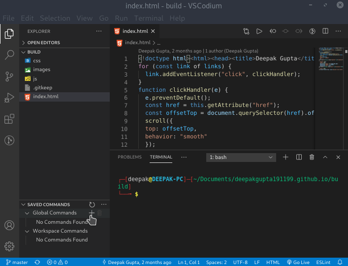

# Save Commands

VSCode Extension to save and copy terminal commands.

# Demo

# Placeholders

You can add placeholders in your commands. For eg, you can add commands in this manner
`This is {placeholder1} and {placeholder2} with {placeholder1} again`
It will ask input for `placeholder1` and `placeholder2`

You can set `save-commands.placeholderType` to change the capturing group in settings.

# Import/Export

You can import and export your commands. 
**Export**: Click on the 3 dots, Select Export, Save it as `.json` file
**Import**: Click on the 3 dots, Select Import, Select the `.json` file

Note: If you only want to replace only one of workspace commands or global commands, you can edit the json to remove the `global` or `workspace` property and then use it 

---

**Enjoy!**
